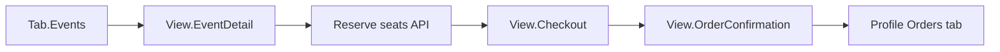

# CraftscapeHK — Core User Journey Map

Navigation is state-driven in `App.tsx` (no React Router). Bottom tabs (`Tab`) host list pages; full-screen overlays (`View`) stack above the active tab. `View.Explore` means no overlay is open, not necessarily the Explore tab.

## Journey A — Co-creation to checkout

```mermaid
flowchart LR
  Explore[Tab.Explore] --> CraftDetail[View.CraftDetail]
  CraftDetail --> AiStudio[View.AiStudio]
  AiStudio --> Submit[Submit co-creation request]
  Submit --> ProfileCreations[Profile Creations tab]
  ProfileCreations --> ArtisanApprove[Artisan Orders queue]
  ArtisanApprove --> PayDeposit[Profile Pay deposit]
  PayDeposit --> Checkout[View.Checkout]
  Checkout --> Confirmation[View.OrderConfirmation]
  Confirmation --> ProfileOrders[Profile Orders tab]
```

| Step | Route / state | Primary file(s) | Primary CTA | Loading | Empty | Error | Success | Cancel |
|------|---------------|-----------------|-------------|---------|-------|-------|---------|--------|
| Discovery | `Tab.Explore` | `pages/Explore.tsx` | Swipe carousel, tap craft | Spinner | `exploreEmpty*` | `exploreLoadError*` | Carousel visible | — |
| Craft detail | `View.CraftDetail` | `views/CraftDetail.tsx` | Co-create / Contact | — | — | — | Detail rendered | Close → base tab |
| AI Studio | `View.AiStudio` | `views/AiStudio.tsx` | Generate, Submit request | Generation spinners | — | `aiStudio*` errors | Contact success modal | Close → craft detail |
| Track request | `Tab.Profile` → Creations | `pages/Profile.tsx` | — | Requests spinner | `profileCoCreationRequestsEmpty` | Silent (shows empty) | Status chips | — |
| Artisan approval | Artisan mode → Orders | `pages/artisan/OrderManagement.tsx` | Approve / Reject / Request changes | Spinner | `artisanCoCreationEmpty` | Load/update banners | Approved ready banner | Reject / changes requested |
| Checkout | `View.Checkout` | `views/CheckoutView.tsx` | Pay (simulated or Stripe) | `checkoutProcessingCta` | — | Inline `errorMessage` | Redirect or simulated complete | `checkoutCancelCta` |
| Confirmation | `View.OrderConfirmation` | `views/OrderConfirmation.tsx` | View my orders / Done / Retry | Processing state | — | Failed/cancelled titles | Success seal + next steps | Cancel order / retry |
| Order tracking | Profile → Orders | `pages/Profile.tsx` | Retry payment | Orders spinner | `profileOrdersEmpty` | `profileOrdersError` / `checkoutReturnError` | Paid/green chips | Cancelled chip |

**Alternate entry:** Marketplace customizable product → `ProductDetail` → AI Studio (`handleOpenProductCustomization`).

## Journey B — Workshop booking to checkout

| Step | Route / state | Primary file(s) | Primary CTA | Loading | Empty | Error | Success | Cancel |
|------|---------------|-----------------|-------------|---------|-------|-------|---------|--------|
| Workshop list | `Tab.Events` | `pages/Events.tsx` | Filter, tap event | Spinner | Filter empty (EN hardcoded) | No fetch error UI (cut list) | List rendered | — |
| Workshop detail | `View.EventDetail` | `views/EventDetail.tsx` | Select slot, Reserve seats | `workshopReservingSeats` | Full slots disabled | `workshopBookingError` | `workshopCheckoutReady` banner | Close → Events |
| Checkout | `View.Checkout` | `views/CheckoutView.tsx` | Pay | Submitting | — | Inline error | Complete | Cancel → event detail |
| Confirmation | `View.OrderConfirmation` | `views/OrderConfirmation.tsx` | View my orders | Processing | — | Failed/cancelled | Workshop success copy | Retry / cancel |
| Tracking | Profile → Orders | `pages/Profile.tsx` | — | Spinner | Empty | Error banner | Booking chip | — |

**Demo workshop:** Obellery event (id 8) supports in-app reservation and checkout handoff.

## Journey C — Marketplace purchase (shorter)

| Step | Route / state | File | CTA | Notes |
|------|---------------|------|-----|-------|
| Browse | `Tab.Marketplace` | `pages/Marketplace.tsx` | Ready-made tab | Loading skeleton, empty, error panels |
| Product detail | `View.ProductDetail` | `views/ProductDetail.tsx` | Purchase | Quote-only/sold-out shows intent stub (out of scope) |
| Checkout → Confirmation → Orders | Same as Journey B checkout row | | | Purchasable standard products only |

## Cross-cutting navigation

- **Stripe return:** `?checkout=success|cancelled&orderId=` handled in `App.tsx` → `OrderConfirmation`, or Profile Orders + `checkoutReturnError` on load failure.
- **View my orders:** `handleViewOrders` sets `profileInitialTab="orders"` and opens `Tab.Profile`.
- **Onboarding:** `OnboardingGuide` overlay; `localStorage.hasSeenOnboarding`; reopen via Profile → Help.
- **Persona:** `DemoPersonaContext` scopes API `customerId` / artisan dashboard (Lane B).

## Known gaps (documented, not Lane C scope)

- Events API fetch has no error UI (tracker cut list).
- Quote-only marketplace products show “intent prepared” stub without checkout.
- Co-creation request fetch errors on Profile appear as empty list.
- Product TextLab path from marketplace is unwired in `App.tsx`.
- No URL deep links for craft/product/event IDs (refresh loses overlay state except Stripe return).
